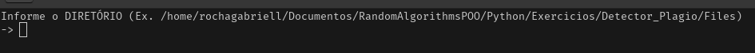
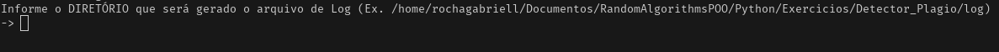
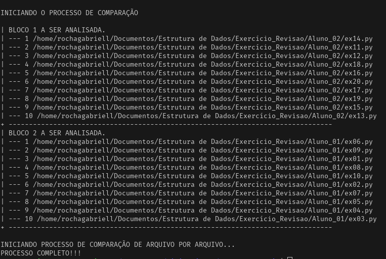
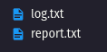

<h1 align="center">Detector Plágio</h1>

_Detector de plágio não detecta plágio. Em vez disso, identifica fragmentos de texto idêntico._

<p align="justify"> O detector de plágio processa o texto para encontrar secções de palavras correspondentes entre os documentos que está a processar e os que indexou nas suas bases de dados.

### 📋 Pré-requisitos

```
Python
```

### 🔧 Instalação


Navegar até o diretório raiz da sua aplicação, abra o terminal e execulte o seguinte comando:

```
$ git clone https://github.com/RochaGabriell/MiniProjects.git
```

Vá até o diretório:

```
$ MiniProjects/Detector_Plagio
```

## ⚙️ Executando os testes

Para execultar, basta digitar no terminal:

```
$ python3 Detector_Plagio/main.py
```
1º Parte - Informe o diretório que será feito a busca:

<p align="center">
  
</p>

2º Parte - Informe o diretório que será salvo os arquivos de registro:

<p align="center">
  
</p>

3º Parte - Será feito a comparação com todas as pastas presentes no diretório:

<p align="center">
  
</p>

4º Parte - O arquivo REPORT informa os arquivos com mais de 50% de similaridade, e o LOG todas as interações feitas pelo algoritmo:

<p align="center">
  
</p>

## 🛠️ Construído com

* [difflib](https://docs.python.org/3/library/difflib.html) - Este módulo fornece classes e funções para comparar sequências.

## 📄 Licença

Este projeto está sob a licença (MIT License) - veja o arquivo [LICENSE.md](https://github.com/RochaGabriell/MiniProjects/blob/main/LICENSE) para detalhes.

---
