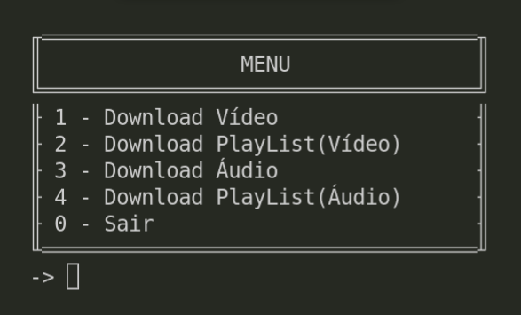

# Download Vídeo e Áudio do YouTube

_NOTA: É destinado a ser usado apenas para fins educacionais._

### 📋 Pré-requisitos

```
Python
PyTube
Moviepy
```

### 🔧 Instalação


Navegar até o diretório raiz da sua aplicação, abra o terminal e execulte o seguinte comando:

```
$ git clone https://github.com/RochaGabriell/MiniProjects.git
```

Vá até o diretório:

```
$ MiniProjects/Youtube_Download
```

E digitar:

```
$ python -m venv env
```

Ativar venv no windows digite no terminal:

```
$ \env\Scripts\activate.bat
```

No linux: 

```
$ source env/bin/activate
```

Instalar os pacotes necessários:

```
$ pip install -r requirements.txt
```
## ⚙️ Executando

<p align="center">
  
</p>

## 🛠️ Construído com

Mencione as ferramentas que você usou para criar seu projeto

* [Pytube](https://github.com/pytube/pytube) - Biblioteca usada para baixar vídeos do web.
* [Moviepy](https://zulko.github.io/moviepy/) - Biblioteca para edição de vídeo.
* [OS](https://docs.python.org/3/library/os.html) - biblioteca é muito utilizada para fazer automação de processos no Python,

## 📄 Licença

Este projeto está sob a licença (MIT License) - veja o arquivo [LICENSE.md](https://github.com/usuario/projeto/licenca) para detalhes.

---